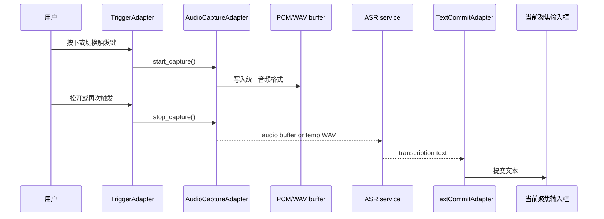
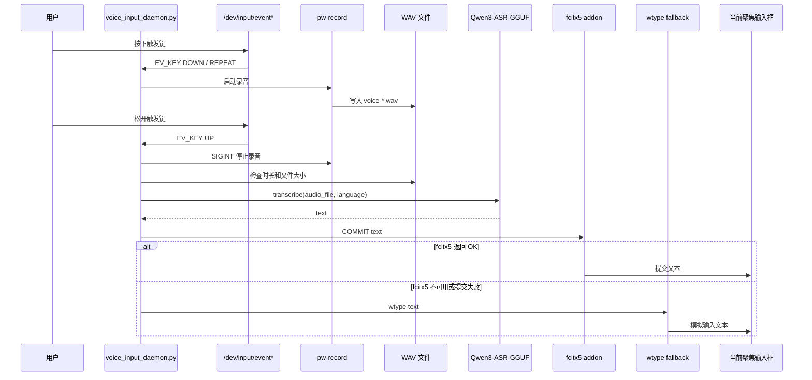

<!--
SPDX-FileCopyrightText: 2026 HarryLoong
SPDX-License-Identifier: MIT
-->

# 简听输入 (VoxKey) / VoxKey Voice Input

简听输入 (VoxKey) 是一个本地优先的语音输入项目。目标是在 Windows、Linux 和
macOS 上提供同一套桌面应用体验：用户安装轻量 UI，首次启动后再根据当前硬件选择
CPU、GPU 或 NPU 运行方案，模型和推理运行时按需下载。

VoxKey is a local-first voice input project. The goal is one desktop app across
Windows, Linux and macOS: users install a lightweight UI, then after first launch
pick a CPU, GPU or NPU runtime based on their hardware, with models and inference
runtimes downloaded on demand.

当前仓库同时保留了已经跑通的 Linux / Wayland 原型。该原型支持按住指定按键录音，
松开后调用本地 Qwen3-ASR-GGUF 转写，并把识别结果提交到当前聚焦输入框。

The repo also keeps the working Linux / Wayland prototype: hold a configured key
to record, release to transcribe with the local Qwen3-ASR-GGUF engine, and commit
the result into the focused input field.


## Project Status / 项目状态

| Area | Status (EN) | 状态（中文） |
| --- | --- | --- |
| Linux / Wayland 原型 | Working, usable today | 已跑通，当前可用 |
| Tauri 桌面应用 | Initialized, being refactored | 已初始化，正在重构 |
| CPU 后端 | Planned cross-platform baseline | 规划中的跨平台基线 |
| GPU 后端 | Planned: Vulkan / Metal / DirectML | 规划中，按平台适配 |
| NPU 后端 | Planned: OpenVINO / QNN / Core ML | 规划中，按平台适配 |
| Windows / macOS 输入链路 | Planned | 规划中 |

已验证的 Linux 原型环境 / Verified Linux prototype environment:

| Item | Value |
| --- | --- |
| OS | Arch Linux x86_64 |
| Desktop | niri / Wayland |
| Linux audio | PipeWire `pw-record` |
| Text commit | fcitx5 addon, fallback to `wtype` |
| ASR | Qwen3-ASR-GGUF 1.7B |
| GPU runtime | llama.cpp Vulkan backend |

其他发行版、桌面环境和输入法需要按实际包名、权限模型和文本提交路径调整。

Other distros, desktops and input methods require adjusting package names, the
permission model and the text-commit path to match the local setup.

## Highlights / 亮点

- 本地优先：录音、转写和文本提交都在本机完成。
  Local-first: recording, transcription and text commit all happen on-device.
- 默认安全：示例配置不绑定、不监听任何硬件按键。
  Safe by default: the example config binds and listens to no hardware key.
- 支持 `hold` 模式：按住录音，松开转写并上屏。
  `hold` mode: press to record, release to transcribe and commit.
- 支持 `toggle` 模式：按一次开始录音，再按一次结束并转写。
  `toggle` mode: one press to start, next press to stop and transcribe.
- 支持按设备名解析 `/dev/input/event*`，降低重启后 event 编号漂移影响。
  Resolves `/dev/input/event*` by device name to survive event-number drift.
- Linux 原型支持 fcitx5 addon 原生提交文本，失败时回退到 `wtype`。
  Native fcitx5 commit with `wtype` fallback.
- 跨平台版本通过平台适配层采集音频；PipeWire 只作为 Linux 实现之一。
  Cross-platform audio via adapters; PipeWire is only one Linux implementation.
- 支持可选复制到剪贴板和桌面通知。
  Optional clipboard copy and desktop notifications.
- 提供单元测试，覆盖配置解析、触发键检测和文本提交 fallback。
  Unit tests cover config parsing, trigger detection and commit fallback.
- 新架构已拆分为桌面 UI、共享核心、平台适配层和 ASR 服务边界。
  New architecture splits into desktop UI, shared core, platform adapters and
  an ASR service boundary.
- 桌面 UI 的后端与运行方案选择会回写到 daemon（见下文“UI 与 daemon 配置桥接”）。
  The desktop UI writes its backend/runtime choices back into the daemon (see
  "UI ↔ daemon config bridge" below).

## Quick Start / 快速开始

当前可直接使用的是 Linux / Wayland 原型。完整安装细节见
[INSTALL.md](INSTALL.md)，模型导入细节见
[docs/import-qwen3-asr-model.md](docs/import-qwen3-asr-model.md)。

The usable path today is the Linux / Wayland prototype. See
[INSTALL.md](INSTALL.md) for full setup and
[docs/import-qwen3-asr-model.md](docs/import-qwen3-asr-model.md) for model import.

```bash
cd back-end/platforms/linux
cp config.example.json config.json
./run.sh --list-devices
./run.sh --detect-key
./run.sh --self-test
./run.sh
```

默认配置不会监听按键 / The default config listens to no key:

```json
{
  "trigger": {
    "enabled": false,
    "backend": "evdev",
    "input_name": null,
    "input_device": null,
    "code": null,
    "mode": "hold"
  }
}
```

`./run.sh --detect-key` 会输出检测到的设备名、event fallback、key code 和建议模式。
确认无误后，把结果写入 `config.json` 的 `trigger` 块，并把 `enabled` 改为 `true`。

`./run.sh --detect-key` prints the detected device name, event fallback, key code
and a suggested mode. Copy the result into the `trigger` block of `config.json` and
set `enabled` to `true`.

示例 / Example:

```json
{
  "trigger": {
    "enabled": true,
    "backend": "evdev",
    "input_name": "keyd virtual keyboard",
    "input_device": "/dev/input/event13",
    "code": 193,
    "name": "voice input key",
    "mode": "hold"
  }
}
```

建议优先保存 `input_name`，把 `input_device` 只当 fallback。这样重启后
`/dev/input/event*` 编号变化时，程序仍可按设备名解析当前 event 设备。

Prefer saving `input_name` and keep `input_device` only as a fallback, so the
daemon still resolves the right `/dev/input/event*` after a reboot renumbers it.

## Voice Input Call Flow / 语音输入调用流程

产品级调用流程不能依赖某一个系统音频栈。VoxKey 应该把语音输入拆成统一抽象：

The product-level flow must not depend on a single system audio stack. VoxKey
models voice input as a uniform abstraction:

```text
TriggerAdapter -> AudioCaptureAdapter -> ASR service -> TextCommitAdapter
```

也就是说，核心逻辑只关心“何时开始录音、何时停止录音、拿到什么格式的音频、
把文本提交到哪里”。具体如何录音由各平台适配器处理。

The core only cares about when to start/stop recording, what audio format it
gets, and where to commit the text. How audio is captured is the adapter's job.



平台适配建议 / Platform adapter notes:

| Platform | Audio capture | Preferred audio handoff | Notes |
| --- | --- | --- | --- |
| Windows | WASAPI | PCM stream or temp WAV | 通过系统麦克风权限；后续可用 Rust `cpal` 或原生 WASAPI 封装 |
| macOS | AVFoundation / CoreAudio | PCM stream or temp WAV | 需要麦克风权限；文本提交另需 Accessibility 或剪贴板 fallback |
| Linux | PipeWire / portal / `pw-record` | PCM stream or temp WAV | `pw-record` 是当前原型实现，不应泄漏到跨平台核心 |

跨平台核心建议固定内部音频格式，例如 16 kHz、mono、signed 16-bit PCM。这样
ASR service 不需要知道音频来自 PipeWire、WASAPI 还是 AVFoundation。

The cross-platform core fixes an internal audio format, e.g. 16 kHz mono signed
16-bit PCM, so the ASR service does not care whether audio came from PipeWire,
WASAPI or AVFoundation.

### Current Linux Prototype Flow / 当前 Linux 原型流程

当前 Linux / Wayland 原型的完整语音输入调用流程如下：



### 1. 配置加载 / Config loading

`run.sh` 位于 `back-end/platforms/linux/`，它会选择 Python 解释器并设置运行环境，然后执行 `back-end/voice-daemon/voice_input_daemon.py`：

`run.sh` (under `back-end/platforms/linux/`) selects the Python interpreter and
sets up the environment, then runs `back-end/voice-daemon/voice_input_daemon.py`:

```bash
cd back-end/platforms/linux
./run.sh
```

配置来源 / Config sources:

| Source | Purpose |
| --- | --- |
| `config.json` | 默认本地配置，不提交到仓库 |
| `QWEN_VOICE_INPUT_CONFIG` | 覆盖配置文件路径 |
| `QWEN_ASR_PROJECT_DIR` | 覆盖 Qwen3-ASR-GGUF 项目路径 |
| `QWEN_ASR_VENV` | 覆盖 Python venv 路径 |
| `QWEN_ASR_PYTHON` | 直接指定 Python 解释器 |
| `GGML_VK_DISABLE_F16` | Vulkan 后端兼容性开关，默认 `1` |

daemon 在读完 `config.json` 后，还会覆盖式地读取桌面 UI 的 Tauri `settings.json`
（详见下文“UI 与 daemon 配置桥接”）。

After reading `config.json`, the daemon also overlays the desktop UI's Tauri
`settings.json` (see "UI ↔ daemon config bridge" below).

### 2. 触发键监听 / Trigger key listening

daemon 启动后会检查 / On startup the daemon checks:

- `trigger.enabled` 是否为 `true` (is `true`)
- `trigger.backend` 是否为 `evdev` (is `evdev`)
- `trigger.code` 是否已配置 (is configured)
- `input_name` 或 `input_device` 是否能解析到可读的 `/dev/input/event*`

通过后，daemon 使用非阻塞方式读取 Linux input event，只处理匹配 `trigger.code`
的 `EV_KEY` 事件。

Once checks pass, the daemon reads Linux input events non-blockingly and only
acts on `EV_KEY` events matching `trigger.code`.

### 3. 录音启动和停止 / Recording start and stop

`hold` 模式 / mode:

- `DOWN` 或 `REPEAT`：如果当前没有录音，启动 `pw-record`
  start `pw-record` if not already recording
- `UP`：停止 `pw-record`，进入转写流程
  stop `pw-record` and enter transcription

`toggle` 模式 / mode:

- 第一次 `DOWN`：启动 `pw-record`
- 下一次 `DOWN`：停止 `pw-record`，进入转写流程

录音命令由 `pw_record` 配置生成，默认参数 / Recording uses the `pw_record` config;
defaults:

```json
{
  "rate": 16000,
  "channels": 1,
  "format": "s16"
}
```

录音文件写入 / Recordings are written to:

```text
$HOME/.local/share/voxkey/recordings/voice-YYYYMMDD-HHMMSS-ffffff.wav
```

停止录音后会检查 / After stopping, the daemon checks:

- 录音时长是否大于 `min_record_seconds`
- WAV 文件是否存在
- 文件大小是否大于 1024 bytes

不满足条件时，本次语音输入会被取消。

If any check fails, the voice input is cancelled.

### 4. ASR 转写 / ASR transcription

daemon 在监听前加载 Qwen3-ASR-GGUF 引擎 / The daemon loads the Qwen3-ASR-GGUF
engine before listening:

```text
asr_project_dir/qwen_asr_gguf/inference/bin
model_dir
python_venv
```

转写调用等价于 / Transcription call:

```python
engine.transcribe(
    audio_file=str(audio_path),
    language=cfg.language,
    context="",
    start_second=0,
    duration=None,
    temperature=0.4,
)
```

如果 `strip_trailing_punctuation` 为 `true`，会在上屏前去掉末尾常见标点。

When `strip_trailing_punctuation` is `true`, trailing punctuation is removed
before commit.

运行方案（UI 选择的 `selected_runtime_id`）会决定本地引擎的 ONNX provider 与
是否启用 GPU：`cpu-onnx-llamacpp` 用纯 CPU，`gpu-directml` 用 DirectML，`gpu-vulkan`
/`gpu-metal`/`npu-coreml` 走 llama.cpp GPU，`npu-openvino-*` 用 OpenVINO。未选择时
沿用默认（CPU provider + llama.cpp GPU 开启）。

The runtime selected in the UI (`selected_runtime_id`) drives the local engine's
ONNX provider and GPU flag: `cpu-onnx-llamacpp` is pure CPU, `gpu-directml` uses
DirectML, `gpu-vulkan`/`gpu-metal`/`npu-coreml` use the llama.cpp GPU path, and
`npu-openvino-*` use OpenVINO. With no selection the legacy default applies (CPU
provider with llama.cpp GPU enabled).

若 `asr_backend` 为 `http`，daemon 改为把音频 POST 到 `asr_service_url/transcribe`。
注意：当前 ASR service 的 `/transcribe` 仅返回 `501 Not Implemented`（占位），因此
选 `http` 后真正可用的前提是开启 `asr_fallback_local`（失败回退本地引擎）或接入真实
后端。

If `asr_backend` is `http`, the daemon POSTs audio to `asr_service_url/transcribe`.
Note: the ASR service's `/transcribe` currently returns `501 Not Implemented`
(placeholder), so the `http` backend only works with `asr_fallback_local` enabled
or a real backend wired in.

### 5. 文本提交 / Text commit

转写成功后，daemon 调用 `insert_text()` / After transcription the daemon calls
`insert_text()`:

1. 如果 `copy_to_clipboard=true`，先通过 `wl-copy` 写入剪贴板。
   If `copy_to_clipboard=true`, copy to clipboard via `wl-copy` first.
2. 如果 `type_text=true` 且 `fcitx_commit=true`，优先向 fcitx5 addon 发送：
   If `type_text=true` and `fcitx_commit=true`, prefer the fcitx5 addon:

   ```text
   COMMIT\n<识别文本>
   ```

3. fcitx5 addon 默认监听 / The fcitx5 addon listens on:

   ```text
   $XDG_RUNTIME_DIR/voxkey-fcitx.sock
   ```

4. 如果 addon 返回 `OK`，文本会通过 fcitx5 当前输入上下文提交到聚焦窗口。
   On `OK` the text is committed via the fcitx5 input context.
5. 如果 addon 超时、无响应或返回失败，daemon 回退到 / On failure the daemon
   falls back to:

   ```bash
   wtype "<识别文本>"
   ```

6. 如果 `type_text=false`，daemon 不模拟输入，只记录识别结果。
   If `type_text=false`, the daemon only logs the result.

### 6. 通知和错误处理 / Notifications and error handling

如果 `notify=true`，daemon 会在这些阶段发送桌面通知 / When `notify=true` the
daemon notifies on:

- 开始录音 (recording started)
- 录音结束，开始转写 (recording stopped, transcribing)
- 转写完成 (transcription done)
- 转写失败 (transcription failed)
- 录音太短或无音频 (too short / no audio)

fcitx5、剪贴板或 `wtype` 的单点失败不会中断整个 daemon。异常会写入日志，下一次
触发键事件仍可继续使用。

A single failure in fcitx5, clipboard or `wtype` never stops the daemon; the error
is logged and the next trigger still works.

## UI ↔ daemon 配置桥接 / UI ↔ daemon config bridge

桌面 UI（Tauri）把 ASR 后端、服务地址、失败回退、超时和所选运行方案写入 Tauri 的
`settings.json`；而 daemon 读的是自己的 `config.json`。两者不是同一份文件，因此
daemon 在启动时主动读取 UI 的 `settings.json` 并覆盖对应的字段，让 GUI 成为同一台
机器上的唯一真源。

The desktop UI (Tauri) writes the ASR backend, service URL, fallback, timeout and
selected runtime into Tauri's `settings.json`, while the daemon reads its own
`config.json`. They are separate files, so on startup the daemon reads the UI's
`settings.json` and overlays those fields, making the GUI the single source of
truth on the same machine.

覆盖字段 / Overlaid fields:

| Tauri settings.json (camelCase) | daemon `config.json` | 含义 |
| --- | --- | --- |
| `asrBackend` | `asr_backend` | `local` 或 `http` |
| `asrServiceUrl` | `asr_service_url` | ASR 服务基址（不含路径） |
| `asrFallbackLocal` | `asr_fallback_local` | 失败后是否回退本地引擎 |
| `asrHttpTimeout` | `asr_http_timeout` | HTTP 请求超时（秒） |
| `selectedRuntimeId` | `selected_runtime_id` | UI 选择的运行方案 |

Tauri `settings.json` 的默认位置（可经 `config.json` 的 `ui_settings_path` 覆盖）/ The
default Tauri `settings.json` location (override via `ui_settings_path` in
`config.json`):

| Platform | Path |
| --- | --- |
| Linux | `$XDG_CONFIG_HOME/dev.xzl01.voxkey/settings.json` |
| macOS | `~/Library/Application Support/dev.xzl01.voxkey/settings.json` |
| Windows | `%APPDATA%\dev.xzl01.voxkey\settings.json` |

若 UI 文件不存在，daemon 仅使用 `config.json`，不影响既有行为。

If the UI file is absent, the daemon uses `config.json` only and behaves as before.

## fcitx5 Addon

fcitx5 addon 是推荐的上屏路径。它监听本机 Unix datagram socket，接收 Python daemon
发来的文本，并通过 fcitx5 当前输入上下文提交。Python daemon 仍保留 `wtype` fallback。

The fcitx5 addon is the recommended commit path. It listens on a local Unix
datagram socket, receives text from the Python daemon, and commits it via the
fcitx5 input context. The Python daemon keeps `wtype` as fallback.

```bash
cd back-end/platforms/linux/fcitx-addon
./install-user.sh
fcitx5 -rd
cd ..
./run.sh --ping-fcitx
```

期望输出 / Expected output:

```text
PONG
```

如暂时不使用 fcitx5 addon，可在 `config.json` 中设置 / To skip the addon set:

```json
"fcitx_commit": false
```

## Model Setup / 模型准备

模型不进入本仓库。推荐目录 / Models are not committed. Suggested layout:

```text
$HOME/AI/
├── VoxKey/
└── Model/
    ├── Qwen3-ASR-GGUF/
    └── llama.cpp-build/
```

最小流程 / Minimal flow:

```bash
python3 -m venv "$HOME/qwen3-asr-venv"
"$HOME/qwen3-asr-venv/bin/pip" install -r back-end/asr-service/requirements.txt
git clone https://github.com/HaujetZhao/Qwen3-ASR-GGUF.git "$HOME/AI/Model/Qwen3-ASR-GGUF"
```

然后下载 1.7B 或 0.6B 预转换模型，并按文档复制 llama.cpp Vulkan 动态库。完整步骤见
[docs/import-qwen3-asr-model.md](docs/import-qwen3-asr-model.md)。

Then download the 1.7B or 0.6B pre-converted model and copy the llama.cpp Vulkan
library per the docs. Full steps in
[docs/import-qwen3-asr-model.md](docs/import-qwen3-asr-model.md).

## Desktop App Development / 桌面应用开发

跨平台应用使用 Tauri v2 + React + TypeScript。React/Vite 只是桌面应用内的 renderer，
不是面向用户分发的网页产品。

The cross-platform app uses Tauri v2 + React + TypeScript. React/Vite is only the
in-app renderer, not a web product.

```bash
pnpm install
pnpm dev
```

常用命令 / Common commands:

| Command | Description |
| --- | --- |
| `pnpm dev` | 启动 Tauri 桌面应用 |
| `pnpm web:dev` | 仅启动 renderer 预览，用于快速调 UI |
| `pnpm service:dev` | 启动 ASR service stub |
| `pnpm check` | 前端 typecheck + Rust workspace check |
| `pnpm desktop:build` | 构建桌面应用包 |

CI 会运行 / CI runs `cargo fmt --all -- --check`、`cargo test -p voxkey-core` 以及
`cargo check -p voxkey-desktop`（需安装 Tauri 的 Linux 构建依赖）。

CI runs `cargo fmt --all -- --check`, `cargo test -p voxkey-core`, and
`cargo check -p voxkey-desktop` (requires Tauri's Linux build deps).

## Repository Layout / 仓库结构

```text
.
├── front-end/                    # 前端 / Front-end
│   └── desktop-ui/               # Tauri desktop shell + React renderer
│       ├── src/                  #   React / TypeScript (cross-platform)
│       ├── src-tauri/            #   Tauri Rust shell (cross-platform core)
│       │   └── platforms/        #     OS-specific Tauri configs / build scripts
│       │       ├── linux/  macos/  windows/
│       ├── index.html  vite.config.ts  tsconfig.json  package.json
│       └── dist/                 #   build output
├── back-end/                     # 后端 / Back-end
│   ├── core/                     # Shared Rust lib (voxkey-core)
│   ├── asr-service/              # Local ASR HTTP service (Python)
│   │   ├── main.py  README.md  requirements.txt
│   ├── voice-daemon/             # Voice input daemon (Python, Linux-oriented)
│   │   ├── voice_input_daemon.py
│   │   └── tests/
│   ├── ruff.toml                 # Python lint config
│   └── platforms/                # OS-specific backend files & deps
│       ├── linux/                #   run.sh, config.example.json, fcitx-addon/, systemd/
│       ├── macos/                #   (placeholder for macOS-specific)
│       └── windows/              #   (placeholder for Windows-specific)
├── docs/                         # Architecture, roadmap, model import notes
├── .github/workflows/ci.yml      # CI (cargo fmt, rust tests, ruff, python tests)
├── Cargo.toml                    # Rust workspace (front-end + back-end members)
├── package.json  pnpm-workspace.yaml  pnpm-lock.yaml
├── README.md  INSTALL.md  LICENSE
└── .gitignore
```

This repository does not include / 本仓库不包含:

- Qwen3-ASR model files
- GGUF / ONNX weights
- llama.cpp build outputs
- Python virtual environments
- Recording cache files
- Local `config.json`

These files are excluded by `.gitignore`.

## Configuration Reference / 配置参考

Important `config.json` fields / 重要 `config.json` 字段:

| Field | Description |
| --- | --- |
| `trigger.enabled` | 是否启用触发键监听，默认 `false` |
| `trigger.input_name` | 优先使用的 Linux input 设备名 |
| `trigger.input_device` | `/dev/input/event*` fallback |
| `trigger.code` | 触发键 key code |
| `trigger.mode` | `hold` 或 `toggle` |
| `recordings_dir` | 录音缓存目录 |
| `asr_project_dir` | Qwen3-ASR-GGUF 项目目录 |
| `model_dir` | 具体模型目录 |
| `python_venv` | Python venv 目录；启动时若实际解释器不在此目录内会告警 |
| `language` | ASR 语言提示，例如 `Chinese` |
| `type_text` | 是否把文本提交到当前输入框 |
| `fcitx_commit` | 是否优先使用 fcitx5 addon |
| `type_command` | fallback 输入命令，默认 `wtype` |
| `copy_to_clipboard` | 是否同步复制到剪贴板 |
| `notify` | 是否发送桌面通知 |
| `strip_trailing_punctuation` | 是否在上屏前去掉末尾常见标点 |
| `asr_backend` | ASR 后端：`local` 本地 Qwen3-ASR 引擎，或 `http` 调用 ASR 服务（`/transcribe`） |
| `asr_service_url` | `http` 后端使用的 ASR 服务基址（不含路径，例如 `http://127.0.0.1:17863`） |
| `asr_fallback_local` | `http` 后端请求失败时是否回退到本地引擎，默认 `true` |
| `asr_http_timeout` | `http` 后端请求超时秒数，默认 `30` |
| `selected_runtime_id` | UI 选择的运行方案（如 `gpu-vulkan`）；驱动本地引擎的 ONNX provider / GPU |
| `ui_settings_path` | 覆盖 Tauri `settings.json` 的查找路径；为空则用平台默认位置 |

## Validation / 验证

```bash
# Python backend tests
cd back-end/voice-daemon
python3 -m unittest discover -s tests -v
python3 -m py_compile voice_input_daemon.py tests/test_voice_input_daemon.py

# Validate example config
cd ../platforms/linux
python3 -m json.tool config.example.json >/dev/null

# Build the Linux fcitx5 addon
cd fcitx-addon
cmake -S . -B build -DCMAKE_BUILD_TYPE=RelWithDebInfo
cmake --build build
cd ../..

pnpm check
```

当前测试覆盖 / Tests currently cover:

- 新旧配置格式解析 / old and new config format parsing
- 默认不监听按键的安全行为 / safe default of not listening to keys
- 输入设备解析和按键检测 / input-device resolution and key detection
- self-test 在 trigger 关闭时跳过 input device 权限检查 / self-test skips device
  permission checks when trigger is disabled
- fcitx5 提交成功路径 / fcitx5 commit success path
- fcitx5 失败后 `wtype` fallback / `wtype` fallback after fcitx5 failure
- `wl-copy` 超时不阻断上屏 / `wl-copy` timeout does not block commit

## Cross-Platform Plan / 跨平台计划

简听输入 (VoxKey) 正在从 Linux / Wayland 原型迁移为跨平台桌面应用。协作时优先查看：

VoxKey is migrating from the Linux / Wayland prototype to a cross-platform desktop
app. When collaborating, consult first:

- [docs/ARCHITECTURE.md](docs/ARCHITECTURE.md)：跨平台架构、模块边界和运行时模型。
- [docs/ROADMAP.md](docs/ROADMAP.md)：阶段计划、模块 backlog、协作规则和待决策问题。
- [docs/DEVELOPMENT.md](docs/DEVELOPMENT.md)：桌面应用、本地服务和验证命令。

目标安装策略 / Target install strategy:

1. 初始安装包只包含桌面 UI、配置、权限引导、运行时检测和服务管理。
2. 首次启动后扫描平台、CPU、GPU、NPU 和可用系统运行时。
3. UI 只展示当前机器可解释的 CPU/GPU/NPU 方案。
4. 用户选择方案后，再下载对应模型和后端运行时。
5. GPU/NPU 失败时必须能回退 CPU。

## Security / 安全

直接读取 `/dev/input/event*` 具备键盘事件读取能力，有明确安全含义。不要默认把用户
加入 `input` 组。更稳妥的方式是只授权目标设备，或使用桌面会话/logind 当前 seat ACL。

Reading `/dev/input/event*` directly grants keystroke-reading capability, which has
clear security implications. Do not add users to the `input` group by default;
prefer authorizing only the target device, or use the desktop session / logind
seat ACL.

本项目默认不启用按键监听。只有用户显式配置 `trigger.enabled=true` 后，daemon 才会
读取 input event。

The project listens to no key by default; the daemon reads input events only after
the user explicitly sets `trigger.enabled=true`.

录音文件默认写入本地缓存目录，不会上传。发布版需要在 UI 中提供清理缓存和诊断导出
选项，且默认不导出用户音频。

Recordings are written to a local cache and never uploaded. Release builds must
offer cache-cleanup and diagnostic-export options in the UI, and must not export
user audio by default.

## Documentation / 文档

- [安装说明](INSTALL.md)
- [跨平台架构](docs/ARCHITECTURE.md)
- [开发说明](docs/DEVELOPMENT.md)
- [路线图](docs/ROADMAP.md)
- [导入 Qwen3-ASR 模型](docs/import-qwen3-asr-model.md)
- [Arch Linux + niri 语音输入部署记录](docs/voxkey-arch-niri.md)
- [Qwen3-ASR-GGUF 在 Arch Linux + Intel GPU 上部署记录](docs/qwen3-asr-gguf-arch-linux.md)

## License / 许可证

本仓库自有代码、文档、测试和 SVG 配图采用 MIT License，见 [LICENSE](LICENSE)。

Self-owned code, docs, tests and SVG assets in this repo are under the MIT License,
see [LICENSE](LICENSE).

外部项目和运行时依赖不随本仓库再分发，并遵循各自上游许可证：

External projects and runtime dependencies are not redistributed with this repo and
follow their own upstream licenses:

- Qwen3-ASR-GGUF 项目和 Qwen 模型权重由用户自行下载并遵循上游许可。
- llama.cpp 动态库由用户自行编译或安装并遵循上游许可。
- fcitx5 运行时和开发库在 Arch Linux 包中标注为
  `LGPL-2.1-or-later AND Unicode-DFS-2016`；本仓库的 fcitx5 addon 源码采用
  MIT，并动态链接本机 fcitx5。
- Linux 原型使用的 Python、PipeWire、wtype、wl-clipboard、libnotify 等运行时依赖
  遵循各自上游许可。

仓库内文件使用 SPDX 标注。JSON、许可证文本等不适合内嵌 SPDX 注释的文件，通过
`.reuse/dep5` 声明版权和许可证。

Files in the repo carry SPDX tags. JSON, license texts and similar files that do
not suit inline SPDX comments declare copyright and license via `.reuse/dep5`.
