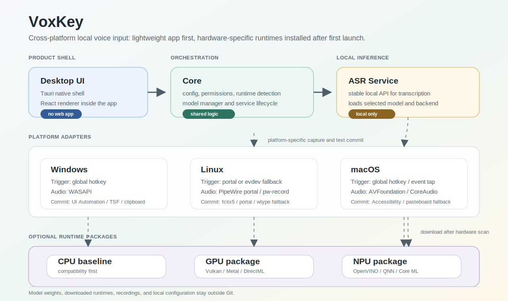
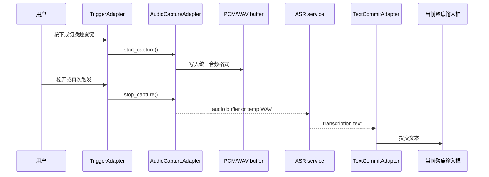
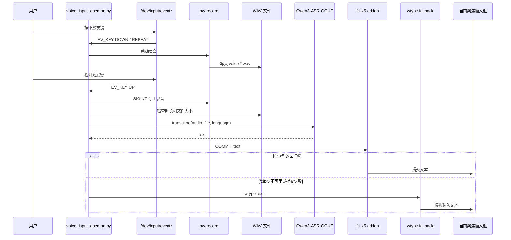

<!--
SPDX-FileCopyrightText: 2026 HarryLoong
SPDX-License-Identifier: MIT
-->

# 简听输入 (VoxKey)

简听输入 (VoxKey) 是一个本地优先的语音输入项目。目标是在 Windows、Linux
和 macOS 上提供同一套桌面应用体验：用户安装轻量 UI，首次启动后再根据当前
硬件选择 CPU、GPU 或 NPU 运行方案，模型和推理运行时按需下载。

当前仓库同时保留了已经跑通的 Linux / Wayland 原型。该原型支持按住指定按键
录音，松开后调用本地 Qwen3-ASR-GGUF 转写，并把识别结果提交到当前聚焦输入框。



## Project Status

| Area | Status |
| --- | --- |
| Linux / Wayland 原型 | 已跑通，当前可用 |
| Tauri 桌面应用 | 已初始化，正在重构 |
| CPU 后端 | 规划中的跨平台基线 |
| GPU 后端 | 规划中，按平台适配 Vulkan / Metal / DirectML |
| NPU 后端 | 规划中，按平台适配 OpenVINO / QNN / Core ML |
| Windows / macOS 输入链路 | 规划中 |

已验证的 Linux 原型环境：

| Item | Value |
| --- | --- |
| OS | Arch Linux x86_64 |
| Desktop | niri / Wayland |
| Linux audio | PipeWire `pw-record` |
| Text commit | fcitx5 addon, fallback to `wtype` |
| ASR | Qwen3-ASR-GGUF 1.7B |
| GPU runtime | llama.cpp Vulkan backend |

其他发行版、桌面环境和输入法需要按实际包名、权限模型和文本提交路径调整。

## Highlights

- 本地优先：录音、转写和文本提交都在本机完成。
- 默认安全：示例配置不绑定、不监听任何硬件按键。
- 支持 `hold` 模式：按住录音，松开转写并上屏。
- 支持 `toggle` 模式：按一次开始录音，再按一次结束并转写。
- 支持按设备名解析 `/dev/input/event*`，降低重启后 event 编号漂移影响。
- Linux 原型支持 fcitx5 addon 原生提交文本，失败时回退到 `wtype`。
- 跨平台版本会通过平台适配层采集音频；PipeWire 只作为 Linux 实现之一。
- 支持可选复制到剪贴板和桌面通知。
- 提供单元测试，覆盖配置解析、触发键检测和文本提交 fallback。
- 新架构已拆分为桌面 UI、共享核心、平台适配层和 ASR 服务边界。

## Quick Start

当前可直接使用的是 Linux / Wayland 原型。完整安装细节见
[INSTALL.md](INSTALL.md)，模型导入细节见
[docs/import-qwen3-asr-model.md](docs/import-qwen3-asr-model.md)。

```bash
cp config.example.json config.json
./run.sh --list-devices
./run.sh --detect-key
./run.sh --self-test
./run.sh
```

默认配置不会监听按键：

```json
{
  "trigger": {
    "enabled": false,
    "backend": "evdev",
    "input_name": null,
    "input_device": null,
    "code": null,
    "mode": "hold"
  }
}
```

`./run.sh --detect-key` 会输出检测到的设备名、event fallback、key code 和建议
模式。确认无误后，把结果写入 `config.json` 的 `trigger` 块，并把
`enabled` 改为 `true`。

示例：

```json
{
  "trigger": {
    "enabled": true,
    "backend": "evdev",
    "input_name": "keyd virtual keyboard",
    "input_device": "/dev/input/event13",
    "code": 193,
    "name": "voice input key",
    "mode": "hold"
  }
}
```

建议优先保存 `input_name`，把 `input_device` 只当 fallback。这样重启后
`/dev/input/event*` 编号变化时，程序仍可按设备名解析当前 event 设备。

## Voice Input Call Flow

产品级调用流程不能依赖某一个系统音频栈。VoxKey 应该把语音输入拆成统一抽象：

```text
TriggerAdapter -> AudioCaptureAdapter -> ASR service -> TextCommitAdapter
```

也就是说，核心逻辑只关心“何时开始录音、何时停止录音、拿到什么格式的音频、
把文本提交到哪里”。具体如何录音由各平台适配器处理。



平台适配建议：

| Platform | Audio capture | Preferred audio handoff | Notes |
| --- | --- | --- | --- |
| Windows | WASAPI | PCM stream or temp WAV | 通过系统麦克风权限；后续可用 Rust `cpal` 或原生 WASAPI 封装 |
| macOS | AVFoundation / CoreAudio | PCM stream or temp WAV | 需要麦克风权限；文本提交另需 Accessibility 或剪贴板 fallback |
| Linux | PipeWire / portal / `pw-record` | PCM stream or temp WAV | `pw-record` 是当前原型实现，不应泄漏到跨平台核心 |

跨平台核心建议固定内部音频格式，例如 16 kHz、mono、signed 16-bit PCM。这样
ASR service 不需要知道音频来自 PipeWire、WASAPI 还是 AVFoundation。

### Current Linux Prototype Flow

当前 Linux / Wayland 原型的完整语音输入调用流程如下：



### 1. 配置加载

`run.sh` 会选择 Python 解释器并设置运行环境，然后执行
`voice_input_daemon.py`：

```bash
./run.sh
```

配置来源：

| Source | Purpose |
| --- | --- |
| `config.json` | 默认本地配置，不提交到仓库 |
| `QWEN_VOICE_INPUT_CONFIG` | 覆盖配置文件路径 |
| `QWEN_ASR_PROJECT_DIR` | 覆盖 Qwen3-ASR-GGUF 项目路径 |
| `QWEN_ASR_VENV` | 覆盖 Python venv 路径 |
| `QWEN_ASR_PYTHON` | 直接指定 Python 解释器 |
| `GGML_VK_DISABLE_F16` | Vulkan 后端兼容性开关，默认 `1` |

### 2. 触发键监听

daemon 启动后会检查：

- `trigger.enabled` 是否为 `true`
- `trigger.backend` 是否为 `evdev`
- `trigger.code` 是否已配置
- `input_name` 或 `input_device` 是否能解析到可读的 `/dev/input/event*`

通过后，daemon 使用非阻塞方式读取 Linux input event，只处理匹配
`trigger.code` 的 `EV_KEY` 事件。

### 3. 录音启动和停止

`hold` 模式：

- `DOWN` 或 `REPEAT`：如果当前没有录音，启动 `pw-record`
- `UP`：停止 `pw-record`，进入转写流程

`toggle` 模式：

- 第一次 `DOWN`：启动 `pw-record`
- 下一次 `DOWN`：停止 `pw-record`，进入转写流程

录音命令由 `pw_record` 配置生成，默认参数：

```json
{
  "rate": 16000,
  "channels": 1,
  "format": "s16"
}
```

录音文件写入：

```text
$HOME/.local/share/voxkey/recordings/voice-YYYYMMDD-HHMMSS-ffffff.wav
```

停止录音后会检查：

- 录音时长是否大于 `min_record_seconds`
- WAV 文件是否存在
- 文件大小是否大于 1024 bytes

不满足条件时，本次语音输入会被取消。

### 4. ASR 转写

daemon 在监听前加载 Qwen3-ASR-GGUF 引擎：

```text
asr_project_dir/qwen_asr_gguf/inference/bin
model_dir
python_venv
```

转写调用等价于：

```python
engine.transcribe(
    audio_file=str(audio_path),
    language=cfg.language,
    context="",
    start_second=0,
    duration=None,
    temperature=0.4,
)
```

如果 `strip_trailing_punctuation` 为 `true`，会在上屏前去掉末尾常见标点。

### 5. 文本提交

转写成功后，daemon 调用 `insert_text()`：

1. 如果 `copy_to_clipboard=true`，先通过 `wl-copy` 写入剪贴板。
2. 如果 `type_text=true` 且 `fcitx_commit=true`，优先向 fcitx5 addon 发送：

   ```text
   COMMIT\n<识别文本>
   ```

3. fcitx5 addon 默认监听：

   ```text
   $XDG_RUNTIME_DIR/voxkey-fcitx.sock
   ```

4. 如果 addon 返回 `OK`，文本会通过 fcitx5 当前输入上下文提交到聚焦窗口。
5. 如果 addon 超时、无响应或返回失败，daemon 回退到：

   ```bash
   wtype "<识别文本>"
   ```

6. 如果 `type_text=false`，daemon 不模拟输入，只记录识别结果。

### 6. 通知和错误处理

如果 `notify=true`，daemon 会在这些阶段发送桌面通知：

- 开始录音
- 录音结束，开始转写
- 转写完成
- 转写失败
- 录音太短或无音频

fcitx5、剪贴板或 `wtype` 的单点失败不会中断整个 daemon。异常会写入日志，
下一次触发键事件仍可继续使用。

## fcitx5 Addon

fcitx5 addon 是推荐的上屏路径。它监听本机 Unix datagram socket，接收 Python
daemon 发来的文本，并通过 fcitx5 当前输入上下文提交。Python daemon 仍保留
`wtype` fallback。

```bash
cd fcitx-addon
./install-user.sh
fcitx5 -rd
cd ..
./run.sh --ping-fcitx
```

期望输出：

```text
PONG
```

如暂时不使用 fcitx5 addon，可在 `config.json` 中设置：

```json
"fcitx_commit": false
```

## Model Setup

模型不进入本仓库。推荐目录：

```text
$HOME/AI/
├── VoxKey/
└── Model/
    ├── Qwen3-ASR-GGUF/
    └── llama.cpp-build/
```

最小流程：

```bash
python3 -m venv "$HOME/qwen3-asr-venv"
"$HOME/qwen3-asr-venv/bin/pip" install -r requirements-asr.txt
git clone https://github.com/HaujetZhao/Qwen3-ASR-GGUF.git "$HOME/AI/Model/Qwen3-ASR-GGUF"
```

然后下载 1.7B 或 0.6B 预转换模型，并按文档复制 llama.cpp Vulkan 动态库。完整
步骤见 [docs/import-qwen3-asr-model.md](docs/import-qwen3-asr-model.md)。

## Desktop App Development

跨平台应用使用 Tauri v2 + React + TypeScript。React/Vite 只是桌面应用内的
renderer，不是面向用户分发的网页产品。

```bash
pnpm install
pnpm dev
```

常用命令：

| Command | Description |
| --- | --- |
| `pnpm dev` | 启动 Tauri 桌面应用 |
| `pnpm web:dev` | 仅启动 renderer 预览，用于快速调 UI |
| `pnpm service:dev` | 启动 ASR service stub |
| `pnpm check` | 前端 typecheck + Rust workspace check |
| `pnpm desktop:build` | 构建桌面应用包 |

## Repository Layout

```text
.
├── apps/desktop-ui/              # Tauri desktop shell and React renderer
├── crates/voxkey-core/           # Shared Rust core types and runtime detection
├── services/asr-service/         # Local ASR service boundary
├── fcitx-addon/                  # Linux fcitx5 commit path
├── systemd/user/voxkey.service   # Linux user service example
├── tests/                        # Python unit tests for the Linux prototype
├── docs/                         # Architecture, roadmap, model import notes
├── voice_input_daemon.py         # Current Linux / Wayland daemon
├── run.sh                        # Linux daemon launcher
├── config.example.json           # Safe default config
└── INSTALL.md                    # Linux prototype install guide
```

This repository does not include:

- Qwen3-ASR model files
- GGUF / ONNX weights
- llama.cpp build outputs
- Python virtual environments
- Recording cache files
- Local `config.json`

These files are excluded by `.gitignore`.

## Configuration Reference

Important `config.json` fields:

| Field | Description |
| --- | --- |
| `trigger.enabled` | 是否启用触发键监听，默认 `false` |
| `trigger.input_name` | 优先使用的 Linux input 设备名 |
| `trigger.input_device` | `/dev/input/event*` fallback |
| `trigger.code` | 触发键 key code |
| `trigger.mode` | `hold` 或 `toggle` |
| `recordings_dir` | 录音缓存目录 |
| `asr_project_dir` | Qwen3-ASR-GGUF 项目目录 |
| `model_dir` | 具体模型目录 |
| `python_venv` | Python venv 目录 |
| `language` | ASR 语言提示，例如 `Chinese` |
| `type_text` | 是否把文本提交到当前输入框 |
| `fcitx_commit` | 是否优先使用 fcitx5 addon |
| `type_command` | fallback 输入命令，默认 `wtype` |
| `copy_to_clipboard` | 是否同步复制到剪贴板 |
| `notify` | 是否发送桌面通知 |

## Validation

```bash
python3 -m unittest discover -s tests -v
python3 -m py_compile voice_input_daemon.py tests/test_voice_input_daemon.py
python3 -m json.tool config.example.json >/dev/null
cmake -S fcitx-addon -B fcitx-addon/build -DCMAKE_BUILD_TYPE=RelWithDebInfo
cmake --build fcitx-addon/build
pnpm check
```

当前测试覆盖：

- 新旧配置格式解析
- 默认不监听按键的安全行为
- 输入设备解析和按键检测
- self-test 在 trigger 关闭时跳过 input device 权限检查
- fcitx5 提交成功路径
- fcitx5 失败后 `wtype` fallback
- `wl-copy` 超时不阻断上屏

## Cross-Platform Plan

简听输入 (VoxKey) 正在从 Linux / Wayland 原型迁移为跨平台桌面应用。协作时优先
查看：

- [docs/ARCHITECTURE.md](docs/ARCHITECTURE.md)：跨平台架构、模块边界和运行时模型。
- [docs/ROADMAP.md](docs/ROADMAP.md)：阶段计划、模块 backlog、协作规则和待决策问题。
- [docs/DEVELOPMENT.md](docs/DEVELOPMENT.md)：桌面应用、本地服务和验证命令。

目标安装策略：

1. 初始安装包只包含桌面 UI、配置、权限引导、运行时检测和服务管理。
2. 首次启动后扫描平台、CPU、GPU、NPU 和可用系统运行时。
3. UI 只展示当前机器可解释的 CPU/GPU/NPU 方案。
4. 用户选择方案后，再下载对应模型和后端运行时。
5. GPU/NPU 失败时必须能回退 CPU。

## Security

直接读取 `/dev/input/event*` 具备键盘事件读取能力，有明确安全含义。不要默认把
用户加入 `input` 组。更稳妥的方式是只授权目标设备，或使用桌面会话/logind
当前 seat ACL。

本项目默认不启用按键监听。只有用户显式配置 `trigger.enabled=true` 后，daemon
才会读取 input event。

录音文件默认写入本地缓存目录，不会上传。发布版需要在 UI 中提供清理缓存和诊断
导出选项，且默认不导出用户音频。

## Documentation

- [安装说明](INSTALL.md)
- [跨平台架构](docs/ARCHITECTURE.md)
- [开发说明](docs/DEVELOPMENT.md)
- [路线图](docs/ROADMAP.md)
- [导入 Qwen3-ASR 模型](docs/import-qwen3-asr-model.md)
- [Arch Linux + niri 语音输入部署记录](docs/voxkey-arch-niri.md)
- [Qwen3-ASR-GGUF 在 Arch Linux + Intel GPU 上部署记录](docs/qwen3-asr-gguf-arch-linux.md)

## License

本仓库自有代码、文档、测试和 SVG 配图采用 MIT License，见 [LICENSE](LICENSE)。

外部项目和运行时依赖不随本仓库再分发，并遵循各自上游许可证：

- Qwen3-ASR-GGUF 项目和 Qwen 模型权重由用户自行下载并遵循上游许可。
- llama.cpp 动态库由用户自行编译或安装并遵循上游许可。
- fcitx5 运行时和开发库在 Arch Linux 包中标注为
  `LGPL-2.1-or-later AND Unicode-DFS-2016`；本仓库的 fcitx5 addon 源码采用
  MIT，并动态链接本机 fcitx5。
- Linux 原型使用的 Python、PipeWire、wtype、wl-clipboard、libnotify 等运行时依赖
  遵循各自上游许可。

仓库内文件使用 SPDX 标注。JSON、许可证文本等不适合内嵌 SPDX 注释的文件，
通过 `.reuse/dep5` 声明版权和许可证。
